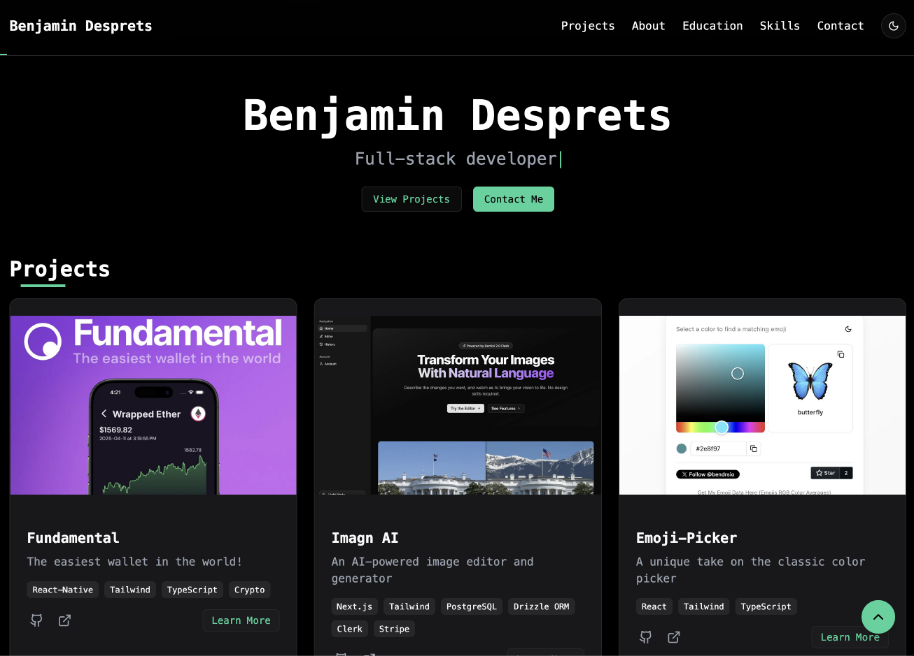

# desprets.net

My personal portfolio website built with **Next.js**, showcasing my projects, skills and more.

> Live site: [https://desprets.net](https://desprets.net) > 

## Table of Contents

- [Features](#features)
- [Tech Stack](#tech-stack)
- [Project Structure](#project-structure)
- [License](#license)

## Features

- 🚀 Fast, server-side rendered pages with Next.js
- 💅 Optimized styling and layout for responsive design
- 🖋️ Markdown-powered blog for easy content authoring
- 🔗 SEO-friendly metadata and Open Graph tags
- 📝 Contact form integration

## Tech Stack

- **Next.js** – React framework for production
- **TypeScript** – Typed JavaScript
- **tailwindcss** – Utility-first CSS framework
- **next/font** – Automatic font optimization (using Geist)

## Project Structure

```text
┌─ public/          # Static assets (images, favicon, etc.)
├─ src/
│  ├─ app/          # Next.js 13 app directory (pages, layouts)
│  ├─ components/   # Reusable UI components
│  ├─ styles/       # Global and component-specific styles
│  ├─ lib/          # Utility functions and API wrappers
│  └─ types/        # TypeScript type definitions
```

## License

This project is licensed under the [MIT License](LICENSE).
